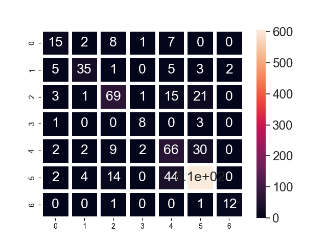

# Skin Lesion

## Introduction

The 7 classes of skin cancer lesions included in this dataset are:
* Melanocytic nevi (nv)
* Melanoma (mel)
* Benign keratosis-like lesions (bkl)
* Basal cell carcinoma (bcc) 
* Actinic keratoses (akiec)
* Vascular lesions (vas)
* Dermatofibroma (df)

---

## Data Preparation

### Initial Data

[(code)](./analysis.py)

* Age

* Classes

* Localization

* Gender

### Balancing

[(code)](./prepare_data.py)

We balanced data by keeping 1000 images for every class. Upscaled classes with less than 1000 images and Downscaled the ones with more.

---

## Models

### ANN - Type 1

[(code)](./ann_with_overfitting.py)

* Architecture:

* History:

* Confusion Matrix:

* Fractional Incorrect Misclassifications:

### ANN - Type 2

[(code)](./ann_no_overfitting.py)

* Architecture:

* History:

* Confusion Matrix:

* Fractional Incorrect Misclassifications:

### CNN

[(code)](./cnn.py)

* Architecture:

* History:

* Confusion Matrix:

* Fractional Incorrect Misclassifications:

### Transfer Learning (Mobilenet)

[(code)](./transfer_learning.py)

* Architecture:

* History:

* Confusion Matrix:

* Fractional Incorrect Misclassifications:

